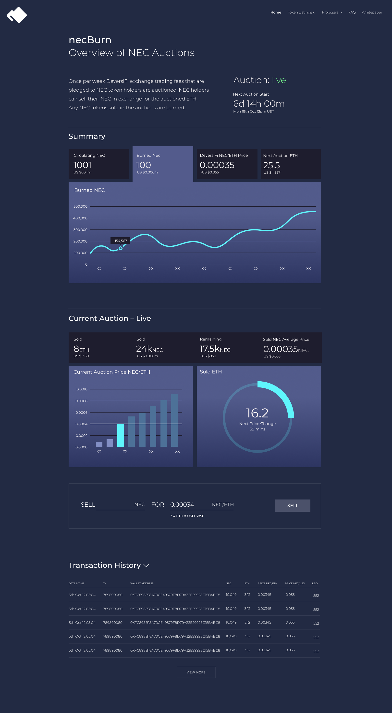

# Nectar Burn Engine

This repository contains a smart-contract auction engine for burning Nectar tokens.

The DeversiFi exchange will contribute some of its fee revenues to this engine, allowing part of the Nectar token supply to be permanently destroyed, reducing circulating supply and increasing scarcity.

Learn more at https://nectar.community/whitepaper

### Install & Test

`npm install`

`npm run test`

Code coverage results can be seen using `open ./coverage/index.html` and can be refreshed by running `npm run coverage`

### UI

A user interface will be made available at https://nectar.community, based on the open-source repository at https://github.com/ethfinex/community-gateway for those who wish to interact with the Nectar Burn Engine in a secure and user friendly way.

Initial mock-ups for the designs are shown below:

